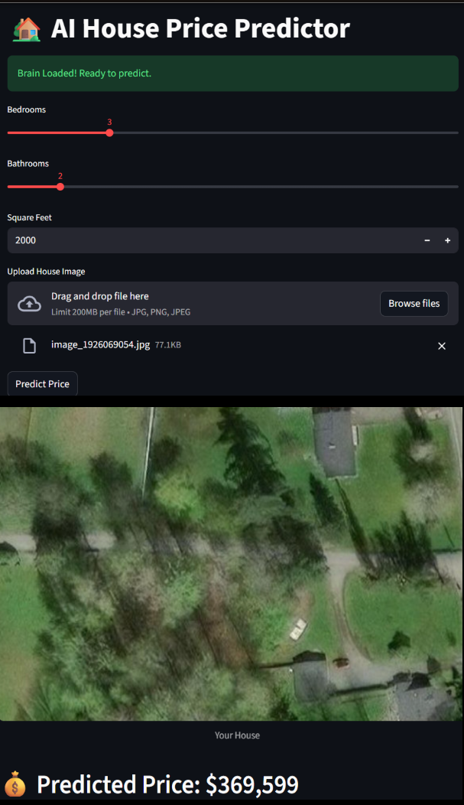

# 🏡 AI House Price Predictor

A hybrid AI application that predicts real estate prices using both **numerical data** (bedrooms, square footage, etc.) and **visual data** (house images). Built with Deep Learning (TensorFlow/Keras) and Streamlit.

## 📸 Application Demo

Below is a screenshot of the application in action, accurately predicting a "HousePrice" .

## 🚀 Live Demo
[Link to Live App](https://housepriceai-4wbwtj8prupxehk6d8tm6t.streamlit.app/)

## 🧠 How It Works
This project uses a **Multi-Input Neural Network**:
1.  **Visual Model (CNN):** Processes images of the house to extract visual features (condition, style, etc.).
2.  **Numerical Model (Dense):** Processes structured data like bedrooms, bathrooms, and square footage.
3.  **Fusion Layer:** Combines both inputs to output a precise price prediction.

## 🛠️ Tech Stack
* **Python**
* **TensorFlow / Keras** (Deep Learning)
* **Streamlit** (Web UI)
* **Pandas & NumPy** (Data Processing)
* **OpenCV** (Image Processing)

## 📂 Project Structure
    notebooks/          # Jupyter notebooks for training and experiments
    sample_images/      # Images used for testing predictions
    app.py              # Main Streamlit application
    house_price_model_v3.h5  # The trained AI model
    cleaned_dataset.csv      # Processed data used for training
    requirements.txt    # List of dependencies

## 💻 How to Run Locally

1. **Clone the repository**
    git clone https://github.com/sumitsolanki8055/HousePriceAI.git
    cd HousePriceAI

2. **Install dependencies**
    pip install -r requirements.txt

3. **Run the app**
    streamlit run app.py

## 📊 Dataset
The model was trained on a real estate dataset containing housing features and corresponding images. The data was cleaned and preprocessed in the `notebooks/` directory.

## 🔮 Future Improvements
* **Deep Learning:** Upgrade from Random Forest to BERT or LSTM for better text understanding.
* **More Languages:** Add support for predicting difficulty in C++ and Java specific contexts.
* **User Feedback:** Allow users to vote on difficulty to retrain the model dynamically.

---
*Created by Sumit Solanki*
